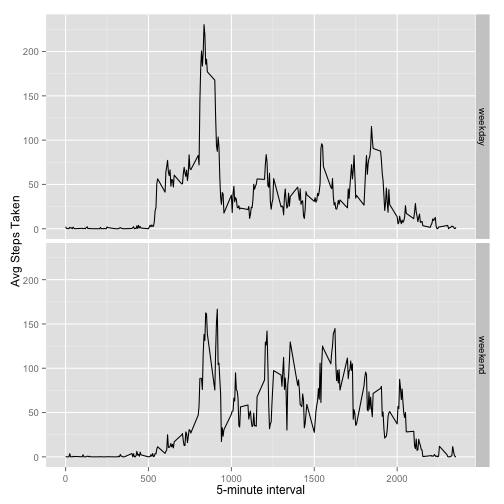

Course Project 01 - Personal Motion Tracker
=============================================

# Introduction

This project uses data from a personal activity monitoring device to answer the questions described in the 'Assignment' section.
The data consists of two months of data from an anonymous individual collected 
during the months of October and November, 2012 and include the number of steps taken in 5 minute intervals each day.

# Data

The variables included in this dataset are:

- steps: Number of steps taking in a 5-minute interval (missing values are coded as NA)
- date: The date on which the measurement was taken in YYYY-MM-DD format
- interval: Identifier for the 5-minute interval in which measurement was taken

The dataset is stored in a comma-separated-value (CSV) file and there are a total of 17,568 observations in this dataset.

# Assignment

## Load R libraries


```r
 library(dplyr)
 library(ggplot2)
```

## Loading and Pre-processing the data

Load the data into R from the activity.csv file.


```r
mydata1 <- read.csv("activity.csv")
```

The number of observations in the dataset is 17568.

## What is mean total number of steps taken per day?

### Calculate the total number of steps taken per day


```r
# select only the date and steps variables of records without missing step values
mydata2 <- mydata1[!(is.na(mydata1$steps)), c("date", "steps")]

# group dataset by date to facilitate plotting histogram
mydata2 <- summarize(group_by(mydata2, date), steps = sum(steps))

steps2 <- mydata2$steps
```

### Make a histogram of the total number of steps taken each day


```r
# plot the summarized dataset
hist(steps2, main = "Histogram of Total Number of Steps Taken Each Day", 
     xlab = "Total Steps Taken Per Day", ylim = c(0,30))
```

 

### Calculate and report the mean and median of the total number of steps taken per day

The mean and median of the total number of steps taken per day are 1.0766189 &times; 10<sup>4</sup> and 10765 respectively.

## What is the average daily activity pattern?

### Make a time-series plot  (i.e. type = "l") of the 5-minute interval (x-axis) and the average number of steps taken, averaged across all days (y-axis)


```r
# select only the date and steps variables of records with missing step values
mydata3 <- mydata1[ , c("interval", "steps")]

# group by interval and calculate the mean of the steps variable (ignoring missing values)
mydata3 <- summarize(group_by(mydata3, interval), 
                       avgSteps = mean(steps, na.rm = TRUE))

# plot the summarized dataset
plot(avgSteps ~ interval, data = mydata3, type = "l", xlim=c(0,2500), ylim=c(0,250), 
     xlab="5-minute Interval", ylab="Avg Steps (averaged across all days)")
```

 

### Which 5-minute interval, on average across all the days in the dataset, contains the maximum number of steps?


```r
# find the max number of steps taken in any interval
maxSteps3 <- max(mydata3$avgSteps)

# select the row(s) from the dataset that have the steps value
# equal to the maxSteps3 value
mydata31 <- mydata3[(mydata3$avgSteps == maxSteps3), ]

# select the interval variable from the first matching row
maxInterval3 <- mydata31[1, "interval"]
```

The 5-minute interval that, on average across all the days in the dataset, contains the maximum number of steps is 835.
The average number of steps taken during that interval is 206.1698113.

## Imputing missing values
Note that there are a number of days/intervals where there are missing values (coded as NA). The presence of missing days may introduce 
bias into some calculations or summaries of the data. 

### Calculate and report the total number of missing values in the dataset 


```r
# The dataset has NA (missing) values only for the 'steps' column 

# read the original dataset into mydata4 with only the records with the missing steps
mydata4 <- mydata1[(is.na(mydata1$steps)), ]
```

The number of missing values in the dataset is 2304.

### Devise a strategy for filling in all of the missing values in the dataset

The strategy used to fill in the missing step values was to use the mean for the 5-minute interval.
The mydata3 dataset has the average number of steps taken for each interval.

### Create a new dataset that is equal to the original dataset but with the missing data filled in


```r
# re-read the entire dataset into mydata4
mydata4 <- mydata1
maxrows <- nrow(mydata4)

# loop through all rows in dataset
for (row in 1:maxrows) {
    
    # for each row with missing steps
    # copy corresponding entry from mydata3 dataset,
    # that has the average steps taken for that interval
    
    if (is.na(mydata4[row, "steps"])) {
          
       currInterval <- as.numeric(mydata4[row, "interval"])

       mydata4[row, "steps"] <- mydata3[mydata3$interval == currInterval, "avgSteps"]
    }      
}
```


### Make a histogram of the total number of steps taken each day 


```r
# select only the date and steps variables of records without missing step values
mydata42 <- mydata4[ , c("date", "steps")]

# group dataset by date to facilitate plotting histogram
mydata42 <- summarize(group_by(mydata42, date), steps = sum(steps))

steps42 <- mydata42$steps

# plot histogram of steps
hist(steps42, xlab = "Steps", ylim = c(0,50),
     main = "Histogram of Total Number of Steps Taken Each Day (imputed values)")
```

 

### Calculate and report the mean and median total number of steps taken per day.

The mean and median of the total number of steps taken per day are 1.0766189 &times; 10<sup>4</sup> and 1.0766189 &times; 10<sup>4</sup> respectively.

### Do these values differ from the estimates from the first part of the assignment?
The mean value remains the same as the first part of the assignment, due the strategy
used for filling in the missing values. But the median value increased slightly from
10765 to 1.0766189 &times; 10<sup>4</sup>.

## Are there differences in activity patterns between weekdays and weekends?

### Create a new factor variable in the dataset with two levels - 'weekday' and 'weekend' indicating whether a given date is a weekday or weekend day


```r
# create variable 'daytype' with two possible values
# since ifelse is vectorized function, we can apply it on mydata4$date variable
mydata5 <- mutate(mydata4, daytype = 
  ifelse( weekdays(as.Date(mydata4$date), abbreviate = TRUE) %in% c("Sat", "Sun"), "weekend", "weekday"))

# convert daytype from type 'character' to 'factor'
mydata5 <- mutate(mydata5, daytype = as.factor(daytype))
```

### Make a panel plot containing a time series plot of the 5-minute interval (x-axis) and the average number of steps taken, averaged across all weekday days or weekend days (y-axis). 


```r
# group dataset by interval and daytype
mydata53 <- summarize(group_by(mydata5, interval, daytype), avgSteps = mean(steps, na.rm = TRUE))

    
g <- ggplot(mydata53, aes(interval, avgSteps))
g + geom_line() + facet_grid(daytype ~ .) + labs( x = "5-minute interval", y= "Avg Steps Taken")
```

 

The number of steps taken in the morning is higher on weekdays than on weekends.
The number of steps taken in the afternoon is higher on weekends than on weekdays.


